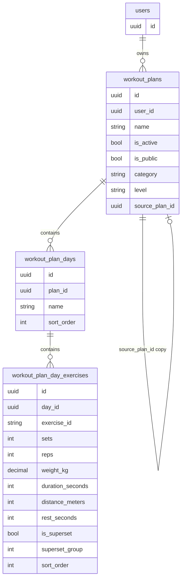

# Архитектура бэкенда: модуль «Планы тренировок»

## 1. Модель данных (PostgreSQL)

### 1.1 Иерархия и таблицы

Цепочка: **План → Тренировочные дни → Упражнения в дне** (с сохранением порядка и поддержкой сплитов).


| Таблица                      | Назначение                                                                                                                 |
| ---------------------------- | -------------------------------------------------------------------------------------------------------------------------- |
| `workout_plans`              | План тренировок (название, владелец, активный флаг, публичный флаг для каталога, источник при копировании).                |
| `workout_plan_days`          | Дни плана (название/метка дня, порядок дня в плане).                                                                       |
| `workout_plan_day_exercises` | Упражнение в конкретном дне: ссылка на упражнение каталога + параметры (подходы, повторения, вес) + порядок + флаг сплита. |


**Каталог упражнений в БД не дублируем** — храним только `exercise_id` (string, slug из [data/examples/exercises.json](data/examples/exercises.json)). Полное описание, медиа, инструкции фронт берёт из кешированного каталога (GET `/api/v1/exercises/data`), обновляемого по версии/ETag.

### 1.2 DDL (ключевые поля)

**workout_plans**

- `id` UUID PRIMARY KEY DEFAULT gen_random_uuid()
- `user_id` UUID NOT NULL REFERENCES users(id) ON DELETE CASCADE
- `name` VARCHAR(200) NOT NULL
- `is_active` BOOLEAN NOT NULL DEFAULT false — только один активный план на пользователя (ограничение через UNIQUE частичный индекс: `UNIQUE (user_id) WHERE is_active = true`)
- `is_public` BOOLEAN NOT NULL DEFAULT false — план отображается в общем каталоге (GET `/api/v1/plans/catalog`); выставлять может только администратор (проверка в usecase, иначе 403)
- `category` VARCHAR(50) NULL — категория плана для фильтрации в каталоге (например «набор массы», «сила»). Допустимые значения — enum (см. ниже). Опционально.
- `level` VARCHAR(20) NULL — уровень подготовки, для которого подходит план: рекомендовать публичный план пользователям с подходящим `training_level`. Значения как у пользователя: `beginner`, `intermediate`, `advanced`. Опционально.
- `source_plan_id` UUID NULL REFERENCES workout_plans(id) ON DELETE SET NULL — при «забрать себе» сохраняем ссылку на оригинал (опционально, для аналитики/атрибуции)
- `created_at`, `updated_at` TIMESTAMPTZ NOT NULL DEFAULT NOW()

**Enum категорий плана (plan_category):** хранить в CHECK или отдельном типе. Примеры значений: `mass_gain` (набор мышечной массы), `strength` (сила), `weight_loss` (сушка/похудение), `endurance` (выносливость), `general` (общая подготовка). Список можно расширять; при добавлении новых значений — миграция с ALTER TABLE / добавлением в CHECK.

**Enum уровня плана (plan_level):** совпадает с уровнем пользователя — `beginner`, `intermediate`, `advanced` (как в internal/domain/user/user.go TrainingLevel).

**workout_plan_days**

- `id` UUID PRIMARY KEY DEFAULT gen_random_uuid()
- `plan_id` UUID NOT NULL REFERENCES workout_plans(id) ON DELETE CASCADE
- `name` VARCHAR(200) NOT NULL — например «День 1 — Грудь», «Понедельник»
- `sort_order` INT NOT NULL DEFAULT 0 — порядок дня внутри плана (0, 1, 2, …)
- `created_at`, `updated_at` TIMESTAMPTZ NOT NULL DEFAULT NOW()
- UNIQUE (plan_id, sort_order) — необязательно, можно управлять порядком без уникальности, тогда просто индекс по (plan_id, sort_order) для сортировки

**workout_plan_day_exercises**

- `id` UUID PRIMARY KEY DEFAULT gen_random_uuid()
- `day_id` UUID NOT NULL REFERENCES workout_plan_days(id) ON DELETE CASCADE
- `exercise_id` VARCHAR(100) NOT NULL — slug из каталога (без FK: каталог — внешний JSON/файл)
- `sets` INT NOT NULL CHECK (sets >= 1 AND sets <= 20)
- `reps` INT NULL — повторения (NULL для формата «время», «дистанция» или «до отказа»)
- `weight_kg` DECIMAL(6,2) NULL — вес в кг; для bodyweight должен быть NULL или 0 (валидация на бэкенде по каталогу)
- `duration_seconds` INT NULL — длительность одного подхода в секундах (для упражнений на время: планка, кардио по времени); для weight-reps/bodyweight-reps — NULL
- `distance_meters` INT NULL — дистанция в метрах (для упражнений по расстоянию: бег, вело, гребля); для остальных типов — NULL
- `rest_seconds` INT NULL — отдых между подходами в секундах; если NULL — фронт/приложение использует рекомендацию из каталога (rest_sec_min/max) или свой дефолт
- `is_superset` BOOLEAN NOT NULL DEFAULT false — флаг «в сплите»: после подхода переключаться на следующее упражнение в том же «блоке»
- `superset_group` INT NULL — если не NULL, упражнения с одинаковым `superset_group` и одним `day_id` образуют суперсет; порядок внутри группы по `sort_order`
- `sort_order` INT NOT NULL DEFAULT 0 — порядок упражнения в дне (и внутри суперсета)
- `created_at`, `updated_at` TIMESTAMPTZ NOT NULL DEFAULT NOW()
- Индекс: (day_id, sort_order) для быстрой выборки упорядоченного списка

**Параметры по типам:** для weight-reps/bodyweight-reps используются sets, reps, weight_kg (для bodyweight — weight_kg NULL). Для упражнений на время (tracking_type time) — sets, duration_seconds, reps NULL. Для упражнений по дистанции — sets, distance_meters (и при необходимости reps NULL). Отдых между подходами (rest_seconds) опционален для любого типа: если NULL, фронт использует рекомендацию из каталога (rest_sec_min/max) или дефолт. Вариант «3 подхода по 10/8/6 повторений с разным весом» можно позже расширить через JSONB `sets_detail` (массив объектов {reps, weight_kg}), не обязательно в первой версии.

### 1.3 Индексы

- `workout_plans`: INDEX (user_id), UNIQUE (user_id) WHERE is_active = true, INDEX (is_public), INDEX (is_public, category), INDEX (is_public, level) для фильтрации каталога
- `workout_plan_days`: INDEX (plan_id), INDEX (plan_id, sort_order)
- `workout_plan_day_exercises`: INDEX (day_id), INDEX (day_id, sort_order), INDEX (day_id, superset_group) для группировки суперсетов

### 1.4 Связка «План → День → Упражнение», порядок и сплиты

- Порядок дней: поле `sort_order` в `workout_plan_days`; при выборке `ORDER BY sort_order`.
- Порядок упражнений в дне: `sort_order` в `workout_plan_day_exercises`; при выборке `ORDER BY sort_order`.
- Сплит: упражнения с одинаковым `day_id` и одинаковым непустым `superset_group` считаются одним суперсетом; фронт показывает их группой и после подхода одного переключается на следующее в группе. Бэкенд при создании/обновлении может проставлять `superset_group` (например, последовательный номер группы в рамках дня) при установке `is_superset = true`.

---

## 2. REST API Endpoints

Базовый префикс: `/api/v1/plans` (все эндпоинты под middleware авторизации, как в [internal/server/server.go](internal/server/server.go) для `/api/v1/users` и `/api/v1/exercises`).

### 2.1 Планы


| Метод  | Путь                | Описание                                                                                                                                                                                          |
| ------ | ------------------- | ------------------------------------------------------------------------------------------------------------------------------------------------------------------------------------------------- |
| GET    | `/api/v1/plans`     | Список планов текущего пользователя (id, name, is_active, category, level, created_at; без вложенных дней).                                                                                       |
| GET    | `/api/v1/plans/:id` | Один план со вложенными днями и упражнениями в днях (полное дерево). Право: владелец или план публичный (is_public = true).                                                                       |
| POST   | `/api/v1/plans`     | Создать план (body: name, опционально is_active, is_public, category, level). Публичный план (is_public: true) может создавать только admin — иначе 403. Возврат: созданный план (без дней).      |
| PUT    | `/api/v1/plans/:id` | Обновить план (name, is_active, is_public, category, level). При is_public: true проверка роли: только admin, иначе 403. При is_active=true снять флаг с предыдущего активного (одна транзакция). |
| DELETE | `/api/v1/plans/:id` | Удалить план (CASCADE удалит дни и упражнения в днях). Только владелец.                                                                                                                           |


### 2.2 Дни плана


| Метод  | Путь                                | Описание                                                     |
| ------ | ----------------------------------- | ------------------------------------------------------------ |
| POST   | `/api/v1/plans/:planId/days`        | Добавить день (body: name, sort_order?). Возврат: день с id. |
| PUT    | `/api/v1/plans/:planId/days/:dayId` | Обновить день (name, sort_order).                            |
| DELETE | `/api/v1/plans/:planId/days/:dayId` | Удалить день (и все упражнения в нём).                       |


### 2.3 Упражнения в дне


| Метод  | Путь                                                           | Описание                                                                                                                                                                                                                                                                                     |
| ------ | -------------------------------------------------------------- | -------------------------------------------------------------------------------------------------------------------------------------------------------------------------------------------------------------------------------------------------------------------------------------------- |
| POST   | `/api/v1/plans/:planId/days/:dayId/exercises`                  | Добавить упражнение в день (body: exercise_id, sets, reps?, weight_kg?, duration_seconds?, distance_meters?, rest_seconds?, is_superset?, sort_order?). Валидация: exercise_id в каталоге; по tracking_type — bodyweight: weight_kg null; time: duration_seconds; distance: distance_meters. |
| PUT    | `/api/v1/plans/:planId/days/:dayId/exercises/:exerciseEntryId` | Обновить параметры (sets, reps, weight_kg, duration_seconds, distance_meters, rest_seconds, is_superset, sort_order).                                                                                                                                                                        |
| DELETE | `/api/v1/plans/:planId/days/:dayId/exercises/:exerciseEntryId` | Удалить упражнение из дня.                                                                                                                                                                                                                                                                   |


### 2.4 Каталог и «забрать план»

**GET `/api/v1/plans/catalog`** — список публичных планов (каталог для выбора готового плана).

- **Назначение:** вернуть планы с `is_public = true` для отображения в каталоге. Поддержка фильтрации по категории и уровню подготовки для рекомендации подходящих планов (например, «планы для набора массы», «планы для начинающих»).
- **Query-параметры (все опциональны):** `category` — фильтр по категории (значение из enum, например `mass_gain`); `level` — фильтр по уровню плана (`beginner` | `intermediate` | `advanced`), чтобы показывать пользователю планы, подходящие его `training_level`; `limit`, `offset` — пагинация.
- **Запрос к БД:** `SELECT id, name, user_id, category, level, created_at [, updated_at] FROM workout_plans WHERE is_public = true [AND category = $1] [AND level = $2] ORDER BY created_at DESC` (вложенные дни и упражнения не подгружаются). Если параметр не передан — условие по нему не накладывается.
- **Ответ:** JSON с массивом планов, например: `{ "plans": [ { "id": "uuid", "name": "...", "author_id": "uuid", "category": "mass_gain", "level": "beginner", "created_at": "..." } ] }`. При необходимости добавить join с `users` и отдавать `author_username` для отображения автора.
- **Доступ:** любой авторизованный пользователь (тот же middleware, что и для остальных эндпоинтов `/api/v1/plans`). Проверка владельца не требуется — каталог общий.

**POST `/api/v1/plans/:id/copy`** — «забрать план себе» (глубокая копия).

- **Назначение:** создать копию выбранного плана в аккаунте текущего пользователя. План копируется целиком: план, все дни, все упражнения в днях с теми же параметрами (sets, reps, weight_kg и т.д.).
- **Проверка доступа:** выполнять копирование только если план с указанным `id` существует и у него `is_public = true`. Если план не найден — 404. Если план не публичный — 403 Forbidden (копировать можно только планы из каталога).
- **Реализация (одна транзакция):**
  1. Прочитать исходный план по id; проверить `is_public = true`.
  2. INSERT в `workout_plans`: `user_id` = текущий пользователь, `name` = имя исходного плана (или «Копия: …»), `is_active` = false, `source_plan_id` = id исходного плана, `is_public` = false (копия всегда личная), `category` = исходный category, `level` = исходный level (копируем метаданные плана).
  3. Для каждого дня исходного плана: INSERT в `workout_plan_days` с новым `plan_id`, те же `name`, `sort_order`.
  4. Для каждой записи в `workout_plan_day_exercises` исходного плана: INSERT с `day_id` = соответствующий новый день, те же `exercise_id`, `sets`, `reps`, `weight_kg`, `duration_seconds`, `distance_meters`, `rest_seconds`, `is_superset`, `superset_group`, `sort_order`. Все первичные ключи — новые UUID.
- **Ответ:** 201 Created, в теле — созданный план (например полное дерево план → дни → упражнения или только id и name нового плана). По согласованию с фронтом.

**Сценарий на клиенте:** пользователь открывает каталог (GET catalog) → выбирает план → просматривает детали (GET `/api/v1/plans/:id`, доступно для публичных) → нажимает «Забрать себе» → POST copy → план появляется в «Моих планах» (GET `/api/v1/plans`).

### 2.5 Примеры запросов/ответов

**POST /api/v1/plans**

```json
// Request
{ "name": "Набор массы: мой план", "is_active": true, "category": "mass_gain", "level": "intermediate" }

// Response 201
{
  "id": "uuid",
  "user_id": "uuid",
  "name": "Набор массы: мой план",
  "is_active": true,
  "category": "mass_gain",
  "level": "intermediate",
  "created_at": "...",
  "updated_at": "..."
}
```

**GET /api/v1/plans/:id** (план с днями и упражнениями)

```json
{
  "id": "uuid",
  "name": "Набор массы: мой план",
  "is_active": true,
  "category": "mass_gain",
  "level": "intermediate",
  "days": [
    {
      "id": "uuid",
      "name": "День 1 — Грудь",
      "sort_order": 0,
      "exercises": [
        {
          "id": "uuid",
          "exercise_id": "dumbbell-bench-press-flat",
          "sets": 4,
          "reps": 10,
          "weight_kg": 25.5,
          "duration_seconds": null,
          "distance_meters": null,
          "rest_seconds": null,
          "is_superset": false,
          "superset_group": null,
          "sort_order": 0
        }
      ]
    }
  ]
}
```

Фронт по `exercise_id` подставляет полное упражнение из своего кеша каталога (GET `/api/v1/exercises/data` + ETag).

**POST /api/v1/plans/:planId/days/:dayId/exercises**

```json
// Request (bodyweight — weight_kg не передаём или 0)
{ "exercise_id": "push-ups", "sets": 3, "reps": 15, "is_superset": true, "sort_order": 1 }
// Response 201 — созданная запись с id, day_id, exercise_id, sets, reps, weight_kg=null, duration_seconds=null, distance_meters=null, rest_seconds=null, ...

// Пример для упражнения на время (планка 60 сек × 3 подхода):
// Request: { "exercise_id": "plank", "sets": 3, "duration_seconds": 60, "sort_order": 2 }
```

---

## 3. Бизнес-логика на бэкенде (Go)

### 3.1 Слои

- **Handler** (например `internal/handler/plans/`) — парсинг body, вызов usecase, маппинг в DTO/JSON. Проверка владельца плана по user_id из JWT.
- **Usecase** (например `internal/usecase/plans/`) — оркестрация: создание/обновление плана, дней, упражнений в днях; вызов репозитория и сервиса каталога для валидации.
- **Repository** (Postgres) — CRUD по таблицам workout_plans, workout_plan_days, workout_plan_day_exercises; при необходимости — интерфейс в `internal/repository/interfaces/`.
- **Exercises catalog** — использование существующего [internal/usecase/exercises](internal/usecase/exercises) (или репозитория каталога): получение по exercise_id и проверка tracking_type (см. [data/examples/exercises-interfaces.go](data/examples/exercises-interfaces.go): `TrackingType`: weight-reps, bodyweight-reps, time и т.д.).

### 3.2 Создание кастомного плана и целостность

- **Создание плана с днями и упражнениями:** предпочтительно пошагово через отдельные эндпоинты (POST plan → POST days → POST exercises), чтобы не раздувать один запрос. Альтернатива: один POST `/api/v1/plans` с телом `{ name, is_active, days: [ { name, sort_order, exercises: [ { exercise_id, sets, reps, weight_kg, ... } ] } ] }` — тогда в usecase одна транзакция: INSERT plan, в цикле INSERT days, в цикле INSERT exercises; при любой ошибке — rollback.
- Транзакции: все мутирующие операции, затрагивающие несколько таблиц (план + дни или день + упражнения), выполнять в одной транзакции (например, через `db.WithTx(ctx, fn)`).

### 3.3 Валидация упражнений

- **Существование exercise_id:** перед сохранением в `workout_plan_day_exercises` вызывать usecase/repository каталога: «получить упражнение по id». Если не найдено — вернуть 400 Bad Request (invalid exercise_id).
- **Тип упражнения (bodyweight, вес, время, дистанция):** по полю каталога `tracking_type`: если `bodyweight-reps` — weight_kg игнорировать или требовать null/0, в БД писать NULL. Для `weight-reps` разрешать weight_kg (nullable). Для `time` — заполнять duration_seconds, reps NULL. Для типа по дистанции — заполнять distance_meters. Список допустимых tracking_type — из каталога или docs/exercises/exercise-json-plan.md.

### 3.4 Активный план

- При установке `is_active = true` для плана A: в одной транзакции обновить план A (SET is_active = true) и снять флаг у всех остальных планов пользователя (UPDATE workout_plans SET is_active = false WHERE user_id = ? AND id != ?).

### 3.5 Публичный план (is_public)

- При создании (POST) или обновлении (PUT) плана, если в теле запроса передано `is_public: true`, в usecase проверять роль текущего пользователя (из JWT/контекста). Если роль не `admin` — возвращать доменную ошибку (например `ErrOnlyAdminCanPublishPlan`); handler маппит её в **403 Forbidden**. Отдельная ручка или middleware не требуются — проверка только в usecase, единая для POST и PUT.

### 3.6 Категория и уровень плана (category, level)

- При передаче `category` в POST/PUT плана: проверять, что значение входит в допустимый enum (mass_gain, strength, weight_loss, endurance, general и т.д.). Иначе — 400 Bad Request с указанием допустимых значений. Если поле не передано — сохранять NULL.
- При передаче `level`: проверять, что значение одно из `beginner`, `intermediate`, `advanced` (как у пользователя). Иначе — 400. Если не передано — NULL.
- В GET catalog при передаче query `category` или `level` валидировать значения так же и применять фильтр к выборке.

---

## 4. Интеграция и кеширование каталога упражнений

- **Бэкенд не хранит каталог в БД** — каталог остаётся в файле/embed (текущая реализация [internal/repository/file/exercises_repository.go](internal/repository/file/exercises_repository.go)). Бэкенд только проверяет наличие exercise_id и смотрит tracking_type при создании/обновлении записей в плане.
- **Версия каталога:** фронт продолжает использовать GET `/api/v1/exercises/version` и GET `/api/v1/exercises/data` с If-None-Match для кеша. В планах хранятся только `exercise_id`; фронт мержит план с каталогом у себя (по id получает полное упражнение с медиа и инструкциями).
- **Рекомендация:** не проксировать каталог через «планы» — отдельные эндпоинты exercises/version и exercises/data остаются источником правды для каталога; планы лишь ссылаются на id.

---

## 5. Масштабирование и задел под аналитику (Future Proof)

- **UUID везде:** все первичные ключи планов, дней и записей «упражнение в дне» — UUID. Это позволит без конфликтов реплицировать или переносить данные в сервис аналитики и связывать «запланированное» с «фактическим» по стабильным id.
- **Связь запланированное ↔ фактическое:** в будущей таблице «история выполнения» (например, `workout_execution_sets` или `training_log_entries`) хранить ссылку на `workout_plan_day_exercises.id` (UUID) как `plan_exercise_id` — «этот подход был выполнен по такому-то пункту плана». Так сервис аналитики сможет джойнить план (упражнение, целевые sets/reps/weight) с фактическими значениями.
- **Не менять id при копировании плана:** при copy создаются новые UUID для плана, дней и упражнений в днях; старые id остаются привязаны к исходному плану. История, если будет привязана к `workout_plan_day_exercises.id`, остаётся консистентной (один id — один контекст плана/дня).
- Опционально: в таблицу планов/дней можно добавить `external_id` (UUID) для кросс-сервисной идентификации, если аналитика будет в отдельном хранилище — тогда один и тот же external_id может использоваться в событиях без привязки к внутреннему PK.

---

## 6. Диаграмма связей (модель данных)




---

## 7. Порядок реализации (рекомендуемый)

1. Миграции: создать таблицы `workout_plans`, `workout_plan_days`, `workout_plan_day_exercises` с индексами и ограничением «один активный план на пользователя».
2. Доменные модели и репозитории (интерфейсы + Postgres), usecase планов с транзакциями и вызовом каталога для валидации exercise_id/tracking_type.
3. Handlers и роуты `/api/v1/plans`, вложенные ресурсы days и exercises.
4. Логика «активный план» (снятие флага при установке нового).
5. Эндпоинты GET catalog (список is_public = true) и POST copy (глубокая копия с проверкой is_public). При приёме is_public в POST/PUT плана — проверка в usecase: только admin может выставлять is_public: true (иначе 403).
6. При появлении аналитики — добавить таблицы истории с ссылкой на `workout_plan_day_exercises.id` (или external_id).

