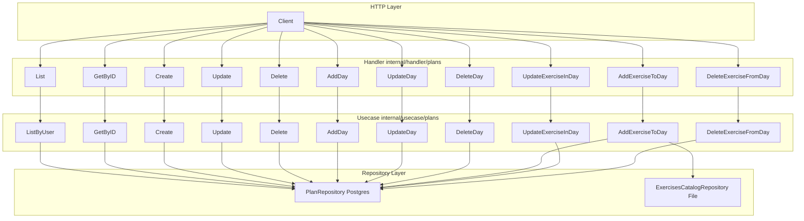

# Модуль «Планы тренировок» — API и архитектура

Документация по реализованным методам REST API и архитектуре модуля планов тренировок (workout plans). Все эндпоинты требуют авторизации (JWT, заголовок `Authorization: Bearer <access_token>`).

---

## 1. Обзор архитектуры

Модуль построен по принципам **Clean Architecture**: разделение на слои Handler → Usecase → Repository, доменные сущности в центре, зависимости направлены внутрь.

### 1.1 Слои и ответственность

| Слой | Пакет | Ответственность |
|------|--------|------------------|
| **Handler** | `internal/handler/plans` | Парсинг HTTP (body, path params), извлечение userID/роли из JWT, вызов usecase, маппинг в DTO, маппинг ошибок в HTTP-коды и формат `response.ErrorBody`. |
| **Usecase** | `internal/usecase/plans` | Бизнес-логика: проверка владельца плана, проверка роли admin при `is_public`, валидация category/level, логика «один активный план», валидация exercise_id по каталогу и нормализация по tracking_type. |
| **Repository** | `internal/repository/interfaces` + `internal/repository/postgres` | Доступ к БД: CRUD планов, дней, записей «упражнение в дне»; транзакции (например, снятие флага is_active у остальных планов). |
| **Domain** | `internal/domain/plan` | Сущности Plan, PlanDay, PlanDayExercise и перечисления PlanCategory, PlanLevel. Без зависимостей от БД и HTTP. |

Для валидации `exercise_id` при добавлении упражнения в день usecase использует **каталог упражнений** (`internal/repository/interfaces.ExercisesCatalogRepository`, метод `GetExerciseByID`).

### 1.2 Диаграмма потока данных



### 1.3 Структура пакетов

```
internal/
├── domain/plan/           # Plan, PlanDay, PlanDayExercise, PlanCategory, PlanLevel
├── handler/plans/          # Handler, DTO (dto.go), маппинг ошибок
├── usecase/plans/         # Service (интерфейс + реализация), входы/выходы, доменные ошибки
├── repository/
│   ├── interfaces/        # PlanRepository, ExerciseInfo, GetExerciseByID в ExercisesCatalogRepository
│   └── postgres/          # PlanRepository (GORM), маппинг pgPlan, pgPlanDay, pgPlanDayExercise
└── repository/file/       # GetExerciseByID для каталога упражнений (JSON)
```

Роуты регистрируются в `internal/server/server.go` в `setupPlansRoutes()`: группа `/api/v1/plans` с middleware `Auth`.

---

## 2. Модель данных

### 2.1 Доменные сущности

- **Plan** — план тренировок: id, user_id, name, is_active, is_public, category, level, source_plan_id, created_at, updated_at; опционально вложенный массив Days.
- **PlanDay** — день плана: id, plan_id, name, sort_order, created_at, updated_at; опционально массив Exercises.
- **PlanDayExercise** — запись упражнения в дне: id, day_id, exercise_id (slug каталога), sets, reps, weight_kg, duration_seconds, distance_meters, rest_seconds, is_superset, superset_group, sort_order, created_at, updated_at.

Полное дерево (план → дни → упражнения) возвращается только в `GET /api/v1/plans/:id`. В списке планов и в ответах создания/обновления плана дни не включаются.

### 2.2 Перечисления

**Категория плана (category):** `mass_gain`, `strength`, `weight_loss`, `endurance`, `general`. Опционально, при передаче в API проверяется на вхождение в этот список.

**Уровень плана (level):** `beginner`, `intermediate`, `advanced`. Опционально, при передаче проверяется на вхождение в список.

### 2.3 База данных

Таблицы: `workout_plans`, `workout_plan_days`, `workout_plan_day_exercises` (миграция `000005_create_workout_plans_tables`). Связи: план → дни (CASCADE), день → упражнения в дне (CASCADE). На пользователя допускается только один активный план (частичный уникальный индекс по `user_id` при `is_active = true`).

---

## 3. Справочник API

Базовый путь: **`/api/v1/plans`**. Все методы требуют заголовка `Authorization: Bearer <access_token>`.

Формат ошибок: тело ответа с полем `error`: `{ "code": "...", "message": "...", "details": ... }`. Коды ошибок см. в разделе 4.

---

### 3.1 Планы

#### GET /api/v1/plans

Список планов текущего пользователя (без вложенных дней).

**Ответ:** `200 OK` — массив объектов:

| Поле | Тип | Описание |
|------|-----|----------|
| id | string (UUID) | Идентификатор плана |
| name | string | Название |
| is_active | boolean | Флаг активного плана |
| category | string \| null | Категория (см. перечисления) |
| level | string \| null | Уровень |
| created_at | string (RFC3339) | Дата создания |

**Ошибки:** 401 (нет/неверный токен), 500.

---

#### GET /api/v1/plans/:id

Один план с полным деревом: дни и упражнения в днях (сортировка по sort_order).

**Параметры пути:** `id` — UUID плана.

**Права доступа:** владелец плана или план публичный (`is_public = true`). Иначе 403.

**Ответ:** `200 OK` — объект:

| Поле | Тип | Описание |
|------|-----|----------|
| id | string | UUID плана |
| name | string | Название |
| is_active | boolean | Активный план |
| category | string \| null | Категория |
| level | string \| null | Уровень |
| days | array | Массив дней (см. ниже) |

Элемент `days[]`:

| Поле | Тип | Описание |
|------|-----|----------|
| id | string | UUID дня |
| name | string | Название дня |
| sort_order | number | Порядок |
| exercises | array | Упражнения в дне (см. ниже) |

Элемент `days[].exercises[]`:

| Поле | Тип | Описание |
|------|-----|----------|
| id | string | UUID записи |
| exercise_id | string | Slug из каталога упражнений |
| sets | number | Количество подходов (1–20) |
| reps | number \| null | Повторения |
| weight_kg | number \| null | Вес (кг) |
| duration_seconds | number \| null | Длительность подхода (сек) |
| distance_meters | number \| null | Дистанция (м) |
| rest_seconds | number \| null | Отдых между подходами (сек) |
| is_superset | boolean | Признак суперсета |
| superset_group | number \| null | Группа суперсета |
| sort_order | number | Порядок в дне |

**Ошибки:** 400 (неверный UUID), 401, 403 (нет доступа), 404 (план не найден), 500.

---

#### POST /api/v1/plans

Создание плана. Дни и упражнения не создаются этим запросом.

**Тело запроса (JSON):**

| Поле | Тип | Обязательное | Описание |
|------|-----|--------------|----------|
| name | string | да | Название (макс. 200 символов) |
| is_active | boolean | нет | По умолчанию false |
| is_public | boolean | нет | По умолчанию false. Только роль **admin** может передать true, иначе 403 |
| category | string | нет | Одно из: mass_gain, strength, weight_loss, endurance, general |
| level | string | нет | Одно из: beginner, intermediate, advanced |

**Ответ:** `201 Created` — объект плана (id, user_id, name, is_active, is_public, category, level, created_at, updated_at). Без дней.

**Ошибки:** 400 (некорректное тело, invalid_category, invalid_level), 401, 403 (в т.ч. is_public: true не для admin), 500.

---

#### PUT /api/v1/plans/:id

Обновление плана (name, is_active, is_public, category, level). Все поля в теле опциональны.

**Параметры пути:** `id` — UUID плана.

**Правила:**
- Только владелец плана может обновлять его (иначе 403).
- Если передано `is_public: true`, роль должна быть **admin**, иначе 403.
- Если передано `is_active: true`, в одной транзакции с текущего плана снимается флаг is_active у всех остальных планов пользователя, затем выставляется у данного.

**Тело запроса (JSON):** все поля опциональны — name (string, max 200), is_active (bool), is_public (bool), category (string из enum), level (string из enum).

**Ответ:** `200 OK` — обновлённый план (без дней): id, user_id, name, is_active, is_public, category, level, created_at, updated_at.

**Ошибки:** 400 (invalid_request, invalid_category, invalid_level), 401, 403, 404, 500.

---

#### DELETE /api/v1/plans/:id

Удаление плана. Каскадно удаляются все дни плана и все записи упражнений в этих днях. Только владелец.

**Параметры пути:** `id` — UUID плана.

**Ответ:** `204 No Content` (тело пустое).

**Ошибки:** 400 (неверный UUID), 401, 403, 404, 500.

---

### 3.2 Дни плана

Все операции с днями требуют, чтобы план принадлежал текущему пользователю (иначе 403 или 404).

#### POST /api/v1/plans/:id/days

Добавить день в план.

**Тело запроса (JSON):**

| Поле | Тип | Обязательное | Описание |
|------|-----|--------------|----------|
| name | string | да | Название дня (макс. 200 символов) |
| sort_order | number | нет | Порядок дня в плане (по умолчанию 0) |

**Ответ:** `201 Created` — объект дня: id, plan_id, name, sort_order, created_at, updated_at.

**Ошибки:** 400, 401, 403, 404 (план не найден или не владелец), 500.

---

#### PUT /api/v1/plans/:id/days/:dayId

Обновить день (name, sort_order). Оба поля в теле опциональны.

**Параметры пути:** `id` — UUID плана, `dayId` — UUID дня.

**Ответ:** `200 OK` — объект дня (id, plan_id, name, sort_order, created_at, updated_at).

**Ошибки:** 400, 401, 403, 404 (план/день не найдены или день не принадлежит плану), 500.

---

#### DELETE /api/v1/plans/:id/days/:dayId

Удалить день. Каскадно удаляются все записи упражнений в этом дне.

**Ответ:** `204 No Content`.

**Ошибки:** 401, 403, 404, 500.

---

### 3.3 Упражнения в дне

Операции с упражнениями в дне требуют владения планом и принадлежности дня этому плану. При добавлении упражнения выполняется проверка: `exercise_id` должен существовать в каталоге упражнений (GET `/api/v1/exercises/data`); поля нормализуются по `tracking_type` каталога (например, для bodyweight обнуляется weight_kg).

#### POST /api/v1/plans/:id/days/:dayId/exercises

Добавить упражнение в день.

**Тело запроса (JSON):**

| Поле | Тип | Обязательное | Описание |
|------|-----|--------------|----------|
| exercise_id | string | да | Slug упражнения из каталога (макс. 100 символов) |
| sets | number | да | Количество подходов (1–20) |
| reps | number | нет | Повторения |
| weight_kg | number | нет | Вес (кг). Для bodyweight в каталоге игнорируется/обнуляется |
| duration_seconds | number | нет | Длительность подхода (сек), для типа time |
| distance_meters | number | нет | Дистанция (м), для типа distance |
| rest_seconds | number | нет | Отдых между подходами (сек) |
| is_superset | boolean | нет | Признак суперсета |
| sort_order | number | нет | Порядок в дне |

**Ответ:** `201 Created` — объект записи упражнения в дне: id, day_id, exercise_id, sets, reps, weight_kg, duration_seconds, distance_meters, rest_seconds, is_superset, superset_group, sort_order, created_at, updated_at.

**Ошибки:** 400 (invalid_request, invalid_exercise_id — упражнение не найдено в каталоге), 401, 403, 404, 500.

---

#### PUT /api/v1/plans/:id/days/:dayId/exercises/:exerciseEntryId

Обновить параметры записи упражнения в дне. Все поля в теле опциональны.

**Параметры пути:** `id` (план), `dayId`, `exerciseEntryId` — UUID.

**Тело запроса (JSON):** sets (1–20), reps, weight_kg, duration_seconds, distance_meters, rest_seconds, is_superset, sort_order — все опциональны.

**Ответ:** `200 OK` — обновлённая запись (та же структура, что и при создании).

**Ошибки:** 400, 401, 403, 404 (план/день/запись не найдены или не совпадают), 500.

---

#### DELETE /api/v1/plans/:id/days/:dayId/exercises/:exerciseEntryId

Удалить запись упражнения из дня.

**Ответ:** `204 No Content`.

**Ошибки:** 400 (неверный UUID), 401, 403, 404, 500.

---

## 4. Коды ошибок и HTTP-статусы

| HTTP | code (в теле) | Описание |
|------|----------------|----------|
| 400 | invalid_request | Некорректное тело запроса или формат UUID |
| 400 | invalid_category | Недопустимая категория плана (в details — allowed_category) |
| 400 | invalid_level | Недопустимый уровень плана (в details — allowed_level) |
| 400 | invalid_exercise_id | exercise_id не найден в каталоге упражнений |
| 401 | unauthorized | Отсутствует или неверный JWT |
| 403 | forbidden | Нет доступа к плану / только admin может выставлять is_public |
| 404 | plan_not_found | План не найден |
| 404 | not_found | План, день или запись упражнения не найдены (для вложенных ресурсов) |
| 500 | internal_error | Внутренняя ошибка сервера |

---

## 5. Бизнес-правила (кратко)

- **Один активный план на пользователя:** при установке `is_active: true` у одного плана у всех остальных планов этого пользователя в той же транзакции выставляется `is_active: false`.
- **Публичный план (is_public):** выставлять `is_public: true` при создании или обновлении плана может только пользователь с ролью **admin**; иначе 403.
- **Доступ к плану по ID:** разрешён владельцу или если план публичный (`is_public = true`).
- **Дни и упражнения в дне:** создание/обновление/удаление разрешено только владельцу плана; день должен принадлежать указанному плану, запись упражнения — указанному дню.
- **Валидация упражнения в дне:** при добавлении проверяется наличие `exercise_id` в каталоге; в зависимости от `tracking_type` обнуляются неиспользуемые поля (например, bodyweight → weight_kg = null).

Дополнительное описание модели данных и сценариев см. в [workout-plans-backend-architecture.md](../workout-plans-backend-architecture.md).
