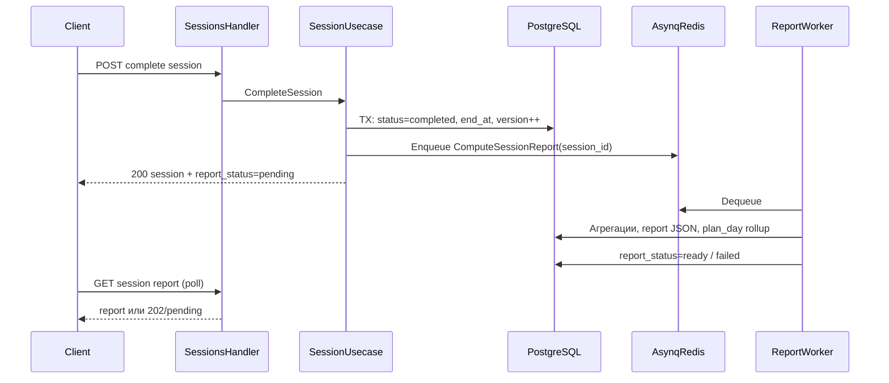

# Архитектура: тренировочные сессии и аналитика

Документ описывает модуль тренировочных сессий, аналитику и интеграцию с **Asynq (Redis)** для фоновых задач. Детали по задачам и кешированию: [background-and-cache.md](background-and-cache.md).

### Зафиксированные продуктовые решения

- **`GET /api/v1/exercises/:exerciseId/performance-history` (Шаг 0):** в выборку входят подходы из сессий пользователя со статусом **`completed`** и **`cancelled`** (частично выполненная тренировка учитывается в «истории за всё время»). Сессии **`in_progress`** в эту выборку **не** включаются — активная тренировка обслуживается отдельными ручками сессии.

## Контекст согласования с текущим модулем

Исходные сущности из [../plan/plans.md](../plan/plans.md): **Plan** → **PlanDay** → **PlanDayExercise** (`workout_plan_day_exercises`: `exercise_id` — slug каталога, `sets`, `reps`, `weight_kg`, `duration_seconds`, `distance_meters`, `rest_seconds`, суперсеты и т.д.). Сессия должна опираться на **снимок (snapshot)** выбранного **дня активного плана** на момент старта, чтобы отчёты и проценты не «плавали» при правках плана позже.

---

## 1. Архитектура сервисов

**Рекомендация: модули одного монолита (микросервисы опционально позже).**

- **Почему монолит с двумя модулями:** уже принят паттерн Handler → Usecase → Repository для планов ([../plan/plans.md](../plan/plans.md)); сессии и аналитика — смежные домены с общей БД и строгой консистентностью «сессия ↔ день плана ↔ подходы». Вынос в отдельные сервисы оправдан при независимым масштабированием, отдельными командами SLI или политикой изоляции данных — до этого момента границы пакетов достаточно.

**Границы ответственности:**

| Модуль | Пакеты (предложение) | Ответственность |
|--------|----------------------|-----------------|
| **Sessions** | `internal/domain/session`, `handler/sessions`, `usecase/sessions`, `repository/postgres` | Старт/завершение/отмена сессии, логирование подходов, замена упражнения с переносом оставшихся подходов, валидация по каталогу (`GetExerciseByID`, `tracking_type` как в планах). |
| **Analytics (read)** | `handler/analytics`, `usecase/analytics` (+ при необходимости read-репозитории) | Список тренировок (дней) плана со статусом и %, детализация выполненной сессии (история по упражнению/слоту). Запись агрегатов — из воркера после `complete`. |
| **Performance history (read)** | `usecase/sessions` для истории по слоту в сессии; `usecase/analytics` или общий read-слой для глобальной истории по упражнению | Два разных сценария (см. ниже). Только чтение из `workout_sessions` / `workout_session_sets`. |

**Сценарий: история выполнений во время упражнения**

- **`GET .../sessions/:sessionId/slots/:slotId/performance-history`** — только **выполненные подходы в рамках данной сессии** по данному слоту (все строки `workout_session_sets` с `session_id` и `slot_id`, при необходимости с `performed_exercise_id` на каждом подходе после замены). Не включает прошлые сессии — экран остаётся лёгким и не дублирует глобальную аналитику.
- **`GET .../exercises/:exerciseId/performance-history`** — **история за всё время** для текущего пользователя: все подходы с `performed_exercise_id = exerciseId` по сессиям со статусом **`completed`** или **`cancelled`** (см. блок «Зафиксированные продуктовые решения»). Обязательны **пагинация** (`limit`, `cursor` по `ended_at` / `logged_at`) и опциональные фильтры: `plan_id`, `plan_day_id`, сужение до слота (`plan_day_exercise_id`), диапазон дат — чтобы не тянуть всю историю в один ответ.
- Клиент в UI собирает картину «сейчас vs прошлое»: сначала узкий ответ по слоту, отдельным запросом — глобальная история по slug упражнения (при замене упражнения пользователь смотрит историю по **выбранному** `exercise_id`).

**Взаимодействие:** HTTP REST остаётся единой точкой входа (`internal/server/server.go` — новые группы роутов). Между модулями **не** дергать HTTP внутри процесса: usecase сессий публикует задачу в очередь Asynq; воркер пишет готовый отчёт в БД; analytics только читает.

**Поток завершения тренировки (асинхронный отчёт):**

**Идемпотентность:** `ComputeSessionReport` должна быть безопасна при повторной доставке (уникальный ключ job на `session_id` + статус «уже посчитано»).

---

## 2. Модель данных

**Принципы:** один ряд **`session_exercise_slot`** на каждую строку `workout_plan_day_exercises` в снимке дня; **плановое** число подходов берётся из снимка (`planned_sets`). **Факт** — строки **`workout_session_sets`** с номером подхода 1…`planned_sets` в рамках слота. Замена упражнения **не** создаёт «дыр» в учёте: все подходы остаются в том же слоте, меняется только **`performed_exercise_id`** (и при необходимости нормализация полей по `tracking_type` для *следующих* подходов).

### 2.1 Сущности и таблицы (логическая модель)

**`workout_sessions`**
- `id` (PK), `user_id` (FK users), `plan_id` (FK workout_plans), `plan_day_id` (FK workout_plan_days)
- `status`: `in_progress` | `completed` | `cancelled`
- `started_at`, `ended_at`, `cancelled_at`
- `report_status`: `pending` | `ready` | `failed` (для UX после complete)
- `report_computed_at`, `report_error` (опционально, кратко)
- `snapshot_version` или `plan_content_hash` (опционально — защита от гонок с редактированием плана; минимум — фиксировать snapshot при старте)

**`workout_session_exercise_slots`** (снимок слотов дня)
- `id`, `session_id` (FK), `plan_day_exercise_id` (FK workout_plan_day_exercises) — **уникально в паре с session_id**
- `sort_order` (копия на момент старта)
- **Плановые цели (копия из плана на старт):** `planned_sets`, `planned_reps`, `planned_weight_kg`, `planned_duration_seconds`, `planned_distance_meters`, `planned_rest_seconds`
- `initial_exercise_id` (slug)
- **`current_exercise_id`** (slug) — после замены обновляется; для UI «что сейчас делаем»
- `replacement_count` или история замен (опционально таблица `session_exercise_replacements` с `at`, `from_exercise_id`, `to_exercise_id`, `after_set_index` для аудита)

**`workout_session_sets`**
- `id`, `session_id`, `slot_id`
- `set_index` (1-based, ≤ `planned_sets` слота)
- `performed_exercise_id` — **какое упражнение фактически выполняло этот подход** (после замены — новый slug)
- Метрики подхода (nullable по типу): `reps`, `weight_kg`, `duration_seconds`, `distance_meters`, **`rest_after_seconds`** (отдых после *этого* подхода; для последнего подхода слота можно NULL)
- `logged_at`, опционально `client_request_id` для идемпотентности

**Ограничения:** UNIQUE(`slot_id`, `set_index`); CHECK `set_index` между 1 и `planned_sets` слота (или мягкая проверка в usecase).

**`workout_session_reports`** (результат воркера, можно JSONB + денормализованные поля для списков)
- `session_id` (PK/FK), `payload` (JSONB): выполнено подходов, суммарный объём (тоннаж и т.д.), средний отдых, **общий % выполнения тренировки**, разбивка по слотам
- Денормализовано для быстрых списков: `completion_percent`, `total_sets_completed`, `total_volume` (см. формулы ниже)

**`plan_day_workout_stats`** (агрегат «день плана ↔ последняя/лучшая сессия» для аналитики списка)
- `user_id`, `plan_id`, `plan_day_id` — уникальная тройка
- `last_session_id`, `last_completed_at`
- `last_completion_percent`, `is_completed` (по продуктовому правилу: например, последняя сессия `completed` и % ≥ порога или просто «есть завершённая сессия за период» — **зафиксировать бизнес-правило** в usecase)
- Опционально: `history_session_ids[]` или только «последняя» — зависит от требования «список тренировок со статусом» (скорее всего по **каждому дню** плана одна строка статуса, а не история всех сессий в этой таблице)

*Альтернатива без лишней таблицы:* для списка дней делать запрос «последняя completed-сессия на этот plan_day_id» — при росте данных материализовать в `plan_day_workout_stats` воркером или триггером.

### 2.2 Процент выполнения и замены

- **На уровне слота:**  
  `slot_percent = min(100, round(100 * count(logged_sets) / planned_sets))`  
  Независимо от того, какой `performed_exercise_id` у подходов — они все считаются в знаменателе `planned_sets` исходного слота плана.
- **На уровне тренировки:**  
  Взвешенный или простой средний по слотам (продуктовое решение): например **среднее арифметическое `slot_percent` по всем слотам снимка** или **сумма выполненных подходов / сумма запланированных** — второй вариант лучше при разном числе подходов в упражнениях.

**Детализация «процент от запланированного к выполненному» по упражнению в истории:** для каждого слота показать planned vs actual; при смеси упражнений в одном слоте — группировать подходы по `performed_exercise_id` и считать вклад в объём отдельно, но **выполнение слота** одно.

### 2.3 Связи (кратко)

`users` 1—N `workout_sessions`  
`workout_sessions` 1—N `workout_session_exercise_slots`  
`workout_session_exercise_slots` 1—N `workout_session_sets`  
`workout_sessions` 1—1 `workout_session_reports` (после готовности отчёта)

### 2.4 История выполнений (без новых таблиц)

Достаточно существующих **`workout_sessions`** + **`workout_session_sets`** (+ join слотов при фильтре по `plan_day_exercise_id`) при наличии индексов:

- **История по слоту в одной сессии:** `WHERE session_id = ? AND slot_id = ? ORDER BY set_index` — покрывает `GET .../sessions/.../slots/.../performance-history`.
- **История за всё время по упражнению:** join `workout_session_sets` с `workout_sessions` по `session_id`, `user_id = текущий`, `performed_exercise_id = :exerciseId`, фильтр **`workout_sessions.status IN ('completed', 'cancelled')`**, сортировка по дате сессии или `logged_at`, **cursor-пагинация**.

**Индексы (уточнить в миграции):** `workout_session_sets (session_id, slot_id, set_index)` для узкой ручки; для глобальной истории — `workout_session_sets (performed_exercise_id, session_id)` и/или `workout_sessions (user_id, ended_at DESC)`; при фильтрах по плану — `workout_sessions (user_id, plan_id, ended_at DESC)` + join на слоты. Проверить планы `EXPLAIN` под реальные запросы.

---

## 3. Список эндпоинтов (REST API)

Базовый префикс: **`/api/v1`**, авторизация JWT как в планах. Ниже — минимальный набор под сценарии.

### 3.1 Тренировочная сессия

| Метод и путь | Назначение |
|--------------|------------|
| `POST /api/v1/plans/:planId/days/:dayId/sessions` | Начать сессию: проверка владельца, активный план, создание `workout_sessions` + строк `slots` из текущего `GET plan` дерева. Ответ: session + slots. |
| `GET /api/v1/sessions/:sessionId` | Текущее состояние: статус, слоты, прогресс, `current_exercise_id` по слотам, частично залогированные подходы. |
| `POST /api/v1/sessions/:sessionId/sets` | Записать подход: тело `slot_id`, `set_index`, метрики, `rest_after_seconds?`. Валидация: не больше `planned_sets`, согласование с `tracking_type` выбранного упражнения (текущего для слота). Идемпотентность по `(session_id, slot_id, set_index)` или `client_request_id`. |
| `POST /api/v1/sessions/:sessionId/slots/:slotId/replace-exercise` | Замена: тело `new_exercise_id`; проверка каталога; **не удалять** уже залогированные подходы; обновить `current_exercise_id`; опционально записать событие замены. Следующие подходы пишутся с новым `performed_exercise_id`. |
| `POST /api/v1/sessions/:sessionId/complete` | Завершить: перевести в `completed`, зафиксировать `ended_at`, `report_status=pending`, поставить задачу в очередь Asynq. Ответ сразу: session + `report_status`. |
| `POST /api/v1/sessions/:sessionId/cancel` | Досрочное окончание: `cancelled`, отчёт — по продукту (полный частичный отчёт или только статистика выполненного); либо тот же async job с флагом. |
| `GET /api/v1/sessions/:sessionId/report` | Итог: если `pending` — `200` с полем статуса или `404` + заголовок Retry-After; если `ready` — `payload` из `workout_session_reports`. |
| `GET /api/v1/sessions/:sessionId/slots/:slotId/performance-history` | Только **выполненные подходы в рамках этой сессии** по этому слоту: массив подходов (`set_index`, метрики, `performed_exercise_id`, `rest_after_seconds`, …). Без данных из прошлых сессий. Доступ: владелец сессии. |
| `GET /api/v1/exercises/:exerciseId/performance-history` | **История за всё время** для текущего пользователя по slug упражнения из каталога: подходы из сессий со статусом **`completed`** или **`cancelled`** (поля сессии: `session_id`, `status`, `ended_at` / `started_at`, при необходимости `plan_id`, `plan_day_id`). Обязательны **`limit`** и **`cursor`**. Опциональные query: `plan_id`, `plan_day_id`, `plan_day_exercise_id`, диапазон дат. |

**Поля отчёта (для UI):** число выполненных подходов; суммарный поднятый вес **корректно по типам** (тоннаж = Σ weight×reps где применимо; для distance/time — свои суммы); среднее `rest_after_seconds` по подходам где задано; общий % выполнения тренировки; разбивка по слотам/упражнениям.

### 3.2 Аналитика (в рамках плана)

| Метод и путь | Назначение |
|--------------|------------|
| `GET /api/v1/plans/:planId/workouts-summary` | Список **дней** плана (`plan_day_id`, имя, порядок) + `status` (`completed` / `not_completed`) + `completion_percent` — из агрегата или вычисление «последняя сессия». |
| `GET /api/v1/plans/:planId/days/:dayId/sessions/latest` | Опционально: последняя завершённая сессия для быстрого перехода к отчёту. |
| `GET /api/v1/sessions/:sessionId/detail` | История по слотам: planned vs actual подходы, группировка по `performed_exercise_id`, процент по слоту (может дублировать report payload). |

Публичные планы (`is_public`) — доступ к аналитике только владельцу (как в планах), если не оговорено иное.

---

## 4. Технологический стек и инфраструктура

**Ядро:** Go + PostgreSQL (как сейчас).

### 4.1 Очередь фоновых задач: **Asynq + Redis** (зафиксированный выбор)

**Стек:** [Asynq](https://github.com/hibiken/asynq) поверх **Redis** — постановка задач в очередь, воркеры, retry, при необходимости [periodic tasks](https://github.com/hibiken/asynq/wiki/Periodic-Tasks) и отдельные очереди по приоритету.

**Обоснование выбора вместо очереди на PostgreSQL (River и аналоги):**

- Расчёт отчёта и запись агрегатов не должны увеличивать нагрузку на PG из‑за churn задач, ретраев и блокировок служебных таблиц очереди.
- Redis и Asynq — распространённый стек для Go; воркеры можно масштабировать горизонтально независимо от API.
- HTTP‑ответ на `complete` остаётся быстрым: короткая транзакция в PG + **enqueue в Asynq**; тяжёлые агрегации — только во воркере.

**Операционные заметки:** нужен доступный Redis (локально/Docker/K8s); мониторинг очереди ([asynqmon](https://github.com/hibiken/asynqmon) и метрики); при недоступности Redis — стратегия ошибки при enqueue (логирование, алерт, опционально повтор или компенсирующий job по расписанию).

### 4.2 Какие задачи выполняются через Asynq

Задачи, **не** выполняемые в HTTP‑запросе пользователя:

| Тип задачи (имя/тип payload) | Триггер | Назначение |
|------------------------------|---------|------------|
| **`ComputeSessionReport`** | `POST /api/v1/sessions/:sessionId/complete` (и по продукту — `POST .../cancel`, если формируется частичный отчёт) | Агрегация подходов, расчёт метрик, запись `workout_session_reports`, выставление `report_status=ready` / `failed`, при наличии модели — обновление `plan_day_workout_stats` |
| **`InvalidateWorkoutsSummaryCache`** (опционально) | После успешного `ComputeSessionReport` или в конце обработчика отчёта | Удаление ключей Redis кеша сводки по `plan_id` / `user_id` (см. §4.3 и [background-and-cache.md](background-and-cache.md)) |
| **`RecomputePlanDayStats`** (опционально) | Если агрегаты вынесены в отдельную таблицу и не считаются только внутри отчёта | Согласование строк `plan_day_workout_stats` |

**Что остаётся синхронным (без Asynq):** старт сессии, лог подхода, замена упражнения, чтение состояния — только Handler → Usecase → PostgreSQL (и каталог упражнений).

**Идемпотентность:** обработчик `ComputeSessionReport` проверяет, что отчёт ещё не готов или не в финальном состоянии, чтобы повторная доставка задачи не портила данные.

Расширенное описание задач, retry и таблица кеширования эндпоинтов: [background-and-cache.md](background-and-cache.md).

### 4.3 Кеширование HTTP (Redis)

Имеет смысл использовать **тот же Redis**, что и для Asynq, с разделением: отдельный **key prefix** (например `cache:`) и/или отдельный **DB index** (например `0` — Asynq, `1` — кеш приложения), если политика эксплуатации допускает один инстанс.

| Эндпоинт | Кешировать | Политика |
|----------|------------|----------|
| `GET /api/v1/plans/:planId/workouts-summary` | **Да (рекомендуется)** | Ключ вида `workouts_summary:{user_id}:{plan_id}`; TTL 30–120 с **или** явная инвалидация после `complete`/`cancel` сессии по этому плану (в т.ч. через задачу Asynq) |
| `GET /api/v1/sessions/:sessionId/report` при готовом отчёте | **Опционально** | Ключ `session_report:{session_id}`; данные иммутабельны после `ready` — допустим длинный TTL; инвалидация при повторном расчёте не требуется при идемпотентности |
| `GET /api/v1/plans/:planId/days/:dayId/sessions/latest` | **Опционально** | Короткий TTL (10–60 с) или инвалидация при старте/завершении сессии по дню |
| `GET /api/v1/sessions/:sessionId` | **Нет** | Горячий путь во время тренировки |
| `GET /api/v1/sessions/:sessionId/slots/:slotId/performance-history` | **Нет** | Меняется при каждом залогированном подходе |
| `POST`/`PUT`/`DELETE` к сессиям и планам | — | После успешной мутации инвалидировать связанные ключи `workouts_summary` / `sessions/latest` по правилам выше |
| `GET /api/v1/exercises/:exerciseId/performance-history` | **По умолчанию нет**; при нагрузке — только первая страница при фиксированных фильтрах | Короткий TTL; полная инвалидация при новых подходах затратна — предпочтительны индексы БД |

**Воркер Asynq:** отдельный процесс `cmd/worker` (или тот же бинарник с подкомандой) — регистрация обработчиков задач, подключение к Redis.

**Наблюдаемость:** метрики Asynq (глубина очереди, retry), `report_failed` в БД; логирование `session_id` в correlation id.

---

## Ключевые файлы для реализации в репозитории

- Маршруты: `internal/server/server.go`
- Паттерн модулей: `internal/handler/plans`, `internal/usecase/plans`, `internal/domain/plan`
- Миграции: `internal/database/migrations/` (новый номер после `000006`)

---

## Открытые продуктовые моменты (зафиксировать до реализации)

- Статус дня в списке: **«выполнена»** = только последняя сессия `completed` и % ≥ X, или любая completed за календарную неделю, или «когда-либо»? Это влияет на поля `plan_day_workout_stats` и запросы.
