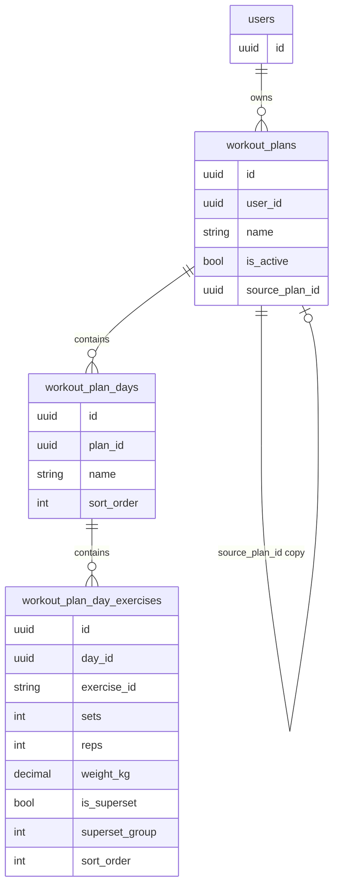

# Архитектура бэкенда: модуль «Планы тренировок»

## 1. Модель данных (PostgreSQL)

### 1.1 Иерархия и таблицы

Цепочка: **План → Тренировочные дни → Упражнения в дне** (с сохранением порядка и поддержкой сплитов).

| Таблица                      | Назначение                                                                                                                 |
| ---------------------------- | -------------------------------------------------------------------------------------------------------------------------- |
| `workout_plans`              | План тренировок (название, владелец, активный флаг, источник при копировании).                                             |
| `workout_plan_days`          | Дни плана (название/метка дня, порядок дня в плане).                                                                       |
| `workout_plan_day_exercises` | Упражнение в конкретном дне: ссылка на упражнение каталога + параметры (подходы, повторения, вес) + порядок + флаг сплита. |

**Каталог упражнений в БД не дублируем** — храним только `exercise_id` (string, slug из [data/examples/exercises.json](../data/examples/exercises.json)). Полное описание, медиа, инструкции фронт берёт из кешированного каталога (GET `/api/v1/exercises/data`), обновляемого по версии/ETag.

### 1.2 DDL (ключевые поля)

**workout_plans**

- `id` UUID PRIMARY KEY DEFAULT gen_random_uuid()
- `user_id` UUID NOT NULL REFERENCES users(id) ON DELETE CASCADE
- `name` VARCHAR(200) NOT NULL
- `is_active` BOOLEAN NOT NULL DEFAULT false — только один активный план на пользователя (ограничение через UNIQUE частичный индекс: `UNIQUE (user_id) WHERE is_active = true`)
- `source_plan_id` UUID NULL REFERENCES workout_plans(id) ON DELETE SET NULL — при «забрать себе» сохраняем ссылку на оригинал (опционально, для аналитики/атрибуции)
- `created_at`, `updated_at` TIMESTAMPTZ NOT NULL DEFAULT NOW()

**workout_plan_days**

- `id` UUID PRIMARY KEY DEFAULT gen_random_uuid()
- `plan_id` UUID NOT NULL REFERENCES workout_plans(id) ON DELETE CASCADE
- `name` VARCHAR(200) NOT NULL — например «День 1 — Грудь», «Понедельник»
- `sort_order` INT NOT NULL DEFAULT 0 — порядок дня внутри плана (0, 1, 2, …)
- `created_at`, `updated_at` TIMESTAMPTZ NOT NULL DEFAULT NOW()
- UNIQUE (plan_id, sort_order) — необязательно, можно управлять порядком без уникальности, тогда просто индекс по (plan_id, sort_order) для сортировки

**workout_plan_day_exercises**

- `id` UUID PRIMARY KEY DEFAULT gen_random_uuid()
- `day_id` UUID NOT NULL REFERENCES workout_plan_days(id) ON DELETE CASCADE
- `exercise_id` VARCHAR(100) NOT NULL — slug из каталога (без FK: каталог — внешний JSON/файл)
- `sets` INT NOT NULL CHECK (sets >= 1 AND sets <= 20)
- `reps` INT NULL — повторения (NULL для формата «время» или «до отказа»)
- `weight_kg` DECIMAL(6,2) NULL — вес в кг; для bodyweight должен быть NULL или 0 (валидация на бэкенде по каталогу)
- `is_superset` BOOLEAN NOT NULL DEFAULT false — флаг «в сплите»: после подхода переключаться на следующее упражнение в том же «блоке»
- `superset_group` INT NULL — если не NULL, упражнения с одинаковым `superset_group` и одним `day_id` образуют суперсет; порядок внутри группы по `sort_order`
- `sort_order` INT NOT NULL DEFAULT 0 — порядок упражнения в дне (и внутри суперсета)
- `created_at`, `updated_at` TIMESTAMPTZ NOT NULL DEFAULT NOW()
- Индекс: (day_id, sort_order) для быстрой выборки упорядоченного списка

**Подходы/повторения:** хранить в одной строке «упражнения в дне» агрегированно: одно значение `sets`, одно `reps` (или null), одно `weight_kg` (или null). Вариант «3 подхода по 10/8/6 повторений с разным весом» можно позже расширить через JSONB `sets_detail` (массив объектов {reps, weight_kg}), не обязательно в первой версии — в первой версии достаточно одного reps/weight_kg на всё упражнение в дне.

### 1.3 Индексы

- `workout_plans`: INDEX (user_id), UNIQUE (user_id) WHERE is_active = true
- `workout_plan_days`: INDEX (plan_id), INDEX (plan_id, sort_order)
- `workout_plan_day_exercises`: INDEX (day_id), INDEX (day_id, sort_order), INDEX (day_id, superset_group) для группировки суперсетов

### 1.4 Связка «План → День → Упражнение», порядок и сплиты

- Порядок дней: поле `sort_order` в `workout_plan_days`; при выборке `ORDER BY sort_order`.
- Порядок упражнений в дне: `sort_order` в `workout_plan_day_exercises`; при выборке `ORDER BY sort_order`.
- Сплит: упражнения с одинаковым `day_id` и одинаковым непустым `superset_group` считаются одним суперсетом; фронт показывает их группой и после подхода одного переключается на следующее в группе. Бэкенд при создании/обновлении может проставлять `superset_group` (например, последовательный номер группы в рамках дня) при установке `is_superset = true`.

---

## 2. REST API Endpoints

Базовый префикс: `/api/v1/plans` (все эндпоинты под middleware авторизации, как в [internal/server/server.go](../internal/server/server.go) для `/api/v1/users` и `/api/v1/exercises`).

### 2.1 Планы

| Метод  | Путь                | Описание                                                                                                                |
| ------ | ------------------- | ----------------------------------------------------------------------------------------------------------------------- |
| GET    | `/api/v1/plans`     | Список планов текущего пользователя (id, name, is_active, created_at; без вложенных дней).                              |
| GET    | `/api/v1/plans/:id` | Один план со вложенными днями и упражнениями в днях (полное дерево). Право: свой план или публичный чужой (см. шаринг). |
| POST   | `/api/v1/plans`     | Создать план (body: name, опционально is_active). Возврат: созданный план (без дней).                                   |
| PUT    | `/api/v1/plans/:id` | Обновить план (name, is_active). При установке is_active=true снять флаг с предыдущего активного (одна транзакция).     |
| DELETE | `/api/v1/plans/:id` | Удалить план (CASCADE удалит дни и упражнения в днях). Только владелец.                                                |

### 2.2 Дни плана

| Метод  | Путь                                | Описание                                                     |
| ------ | ----------------------------------- | ------------------------------------------------------------ |
| POST   | `/api/v1/plans/:planId/days`        | Добавить день (body: name, sort_order?). Возврат: день с id. |
| PUT    | `/api/v1/plans/:planId/days/:dayId` | Обновить день (name, sort_order).                            |
| DELETE | `/api/v1/plans/:planId/days/:dayId` | Удалить день (и все упражнения в нём).                       |

### 2.3 Упражнения в дне

| Метод  | Путь                                                           | Описание                                                                                                                                                                                                                     |
| ------ | -------------------------------------------------------------- | ---------------------------------------------------------------------------------------------------------------------------------------------------------------------------------------------------------------------------- |
| POST   | `/api/v1/plans/:planId/days/:dayId/exercises`                  | Добавить упражнение в день (body: exercise_id, sets, reps?, weight_kg?, is_superset?, sort_order?). Валидация: exercise_id есть в каталоге; при tracking_type bodyweight-reps — weight_kg игнорировать или требовать null/0. |
| PUT    | `/api/v1/plans/:planId/days/:dayId/exercises/:exerciseEntryId` | Обновить параметры (sets, reps, weight_kg, is_superset, sort_order).                                                                                                                                                           |
| DELETE | `/api/v1/plans/:planId/days/:dayId/exercises/:exerciseEntryId` | Удалить упражнение из дня.                                                                                                                                                                                                   |

### 2.4 Каталог и «забрать план»

| Метод | Путь                     | Описание                                                                                                                                                                                                                        |
| ----- | ------------------------ | ------------------------------------------------------------------------------------------------------------------------------------------------------------------------------------------------------------------------------- |
| GET   | `/api/v1/plans/catalog`  | Список готовых (шаблонных) планов из общего каталога — если решите хранить шаблоны в БД или отдавать статичный JSON; иначе этот эндпоинт не нужен, а «выбор из каталога» — просто создание плана из шаблона через copy.         |
| POST  | `/api/v1/plans/:id/copy` | «Забрать план себе»: создать глубокую копию плана (новый plan, новые days, новые workout_plan_day_exercises) с user_id = текущий пользователь, source_plan_id = id. Доступ: если план публичный или по share-токену (см. ниже). |

### 2.5 Шаринг (расширение)

- В таблицу `workout_plans` добавить поле `share_token` UUID NULL UNIQUE (генерируется по запросу) и/или `is_public` BOOLEAN.
- GET `/api/v1/plans/shared/:shareToken` — отдать план только для чтения (без возможности редактирования), чтобы другой пользователь мог посмотреть и вызвать copy.
- POST `/api/v1/plans/:id/share` — выдать/обновить share_token или включить is_public (в зависимости от выбранной модели).

**Копирование (глубокая копия):** одна транзакция: INSERT workout_plans (user_id, name, is_active=false, source_plan_id=:id), затем для каждого дня INSERT workout_plan_days (plan_id=новый, name, sort_order), затем для каждой записи workout_plan_day_exercises INSERT с day_id=новый день, те же exercise_id, sets, reps, weight_kg, is_superset, superset_group, sort_order. Идентификаторы всех новых сущностей — новые UUID.

### 2.6 Примеры запросов/ответов

**POST /api/v1/plans**

```json
// Request
{ "name": "Набор массы: мой план", "is_active": true }

// Response 201
{
  "id": "uuid",
  "user_id": "uuid",
  "name": "Набор массы: мой план",
  "is_active": true,
  "created_at": "...",
  "updated_at": "..."
}
```

**GET /api/v1/plans/:id** (план с днями и упражнениями)

```json
{
  "id": "uuid",
  "name": "Набор массы: мой план",
  "is_active": true,
  "days": [
    {
      "id": "uuid",
      "name": "День 1 — Грудь",
      "sort_order": 0,
      "exercises": [
        {
          "id": "uuid",
          "exercise_id": "dumbbell-bench-press-flat",
          "sets": 4,
          "reps": 10,
          "weight_kg": 25.5,
          "is_superset": false,
          "superset_group": null,
          "sort_order": 0
        }
      ]
    }
  ]
}
```

Фронт по `exercise_id` подставляет полное упражнение из своего кеша каталога (GET `/api/v1/exercises/data` + ETag).

**POST /api/v1/plans/:planId/days/:dayId/exercises**

```json
// Request (bodyweight — weight_kg не передаём или 0)
{ "exercise_id": "push-ups", "sets": 3, "reps": 15, "is_superset": true, "sort_order": 1 }
// Response 201 — созданная запись workout_plan_day_exercises с id, day_id, exercise_id, sets, reps, weight_kg=null, ...
```

---

## 3. Бизнес-логика на бэкенде (Go)

### 3.1 Слои

- **Handler** (например `internal/handler/plans/`) — парсинг body, вызов usecase, маппинг в DTO/JSON. Проверка владельца плана по user_id из JWT.
- **Usecase** (например `internal/usecase/plans/`) — оркестрация: создание/обновление плана, дней, упражнений в днях; вызов репозитория и сервиса каталога для валидации.
- **Repository** (Postgres) — CRUD по таблицам workout_plans, workout_plan_days, workout_plan_day_exercises; при необходимости — интерфейс в `internal/repository/interfaces/`.
- **Exercises catalog** — использование существующего [internal/usecase/exercises](../internal/usecase/exercises) (или репозитория каталога): получение по exercise_id и проверка tracking_type (см. [data/examples/exercises-interfaces.go](../data/examples/exercises-interfaces.go): `TrackingType`: weight-reps, bodyweight-reps, time и т.д.).

### 3.2 Создание кастомного плана и целостность

- **Создание плана с днями и упражнениями:** предпочтительно пошагово через отдельные эндпоинты (POST plan → POST days → POST exercises), чтобы не раздувать один запрос. Альтернатива: один POST `/api/v1/plans` с телом `{ name, is_active, days: [ { name, sort_order, exercises: [ { exercise_id, sets, reps, weight_kg, ... } ] } ] }` — тогда в usecase одна транзакция: INSERT plan, в цикле INSERT days, в цикле INSERT exercises; при любой ошибке — rollback.
- Транзакции: все мутирующие операции, затрагивающие несколько таблиц (план + дни или день + упражнения), выполнять в одной транзакции (например, через `db.WithTx(ctx, fn)`).

### 3.3 Валидация упражнений

- **Существование exercise_id:** перед сохранением в `workout_plan_day_exercises` вызывать usecase/repository каталога: «получить упражнение по id». Если не найдено — вернуть 400 Bad Request (invalid exercise_id).
- **Тип упражнения (bodyweight и вес):** по полю каталога `tracking_type`: если `bodyweight-reps` (или аналог), то в запросе игнорировать `weight_kg` или требовать null/0; при сохранении писать в БД `weight_kg = NULL`. Для `weight-reps` разрешать `weight_kg` (nullable). Для `time` — reps может быть null, сохранять как есть. Список допустимых tracking_type взять из каталога или из [exercise-json-plan.md](exercises/exercise-json-plan.md).

### 3.4 Активный план

- При установке `is_active = true` для плана A: в одной транзакции обновить план A (SET is_active = true) и снять флаг у всех остальных планов пользователя (UPDATE workout_plans SET is_active = false WHERE user_id = ? AND id != ?).

---

## 4. Интеграция и кеширование каталога упражнений

- **Бэкенд не хранит каталог в БД** — каталог остаётся в файле/embed (текущая реализация [internal/repository/file/exercises_repository.go](../internal/repository/file/exercises_repository.go)). Бэкенд только проверяет наличие exercise_id и смотрит tracking_type при создании/обновлении записей в плане.
- **Версия каталога:** фронт продолжает использовать GET `/api/v1/exercises/version` и GET `/api/v1/exercises/data` с If-None-Match для кеша. В планах хранятся только `exercise_id`; фронт мержит план с каталогом у себя (по id получает полное упражнение с медиа и инструкциями).
- **Рекомендация:** не проксировать каталог через «планы» — отдельные эндпоинты exercises/version и exercises/data остаются источником правды для каталога; планы лишь ссылаются на id.

---

## 5. Масштабирование и задел под аналитику (Future Proof)

- **UUID везде:** все первичные ключи планов, дней и записей «упражнение в дне» — UUID. Это позволит без конфликтов реплицировать или переносить данные в сервис аналитики и связывать «запланированное» с «фактическим» по стабильным id.
- **Связь запланированное ↔ фактическое:** в будущей таблице «история выполнения» (например, `workout_execution_sets` или `training_log_entries`) хранить ссылку на `workout_plan_day_exercises.id` (UUID) как `plan_exercise_id` — «этот подход был выполнен по такому-то пункту плана». Так сервис аналитики сможет джойнить план (упражнение, целевые sets/reps/weight) с фактическими значениями.
- **Не менять id при копировании плана:** при copy создаются новые UUID для плана, дней и упражнений в днях; старые id остаются привязаны к исходному плану. История, если будет привязана к `workout_plan_day_exercises.id`, остаётся консистентной (один id — один контекст плана/дня).
- **Статус выполнения дней:** информация о том, выполнен ли тренировочный день, изолирована в сервисе аналитики. Фронт получает статусы по дням (выполнено/не выполнено, даты) через API аналитики; модуль планов не хранит и не отдаёт эту информацию.
- Опционально: в таблицу планов/дней можно добавить `external_id` (UUID) для кросс-сервисной идентификации, если аналитика будет в отдельном хранилище — тогда один и тот же external_id может использоваться в событиях без привязки к внутреннему PK.

---

## 6. Диаграмма связей (модель данных)



---

## 7. Порядок реализации (рекомендуемый)

1. Миграции: создать таблицы `workout_plans`, `workout_plan_days`, `workout_plan_day_exercises` с индексами и ограничением «один активный план на пользователя».
2. Доменные модели и репозитории (интерфейсы + Postgres), usecase планов с транзакциями и вызовом каталога для валидации exercise_id/tracking_type.
3. Handlers и роуты `/api/v1/plans`, вложенные ресурсы days и exercises.
4. Логика «активный план» (снятие флага при установке нового).
5. Эндпоинт copy (глубокая копия) и при необходимости share (share_token / is_public + GET shared plan).
6. При появлении аналитики — добавить таблицы истории с ссылкой на `workout_plan_day_exercises.id` (или external_id).
